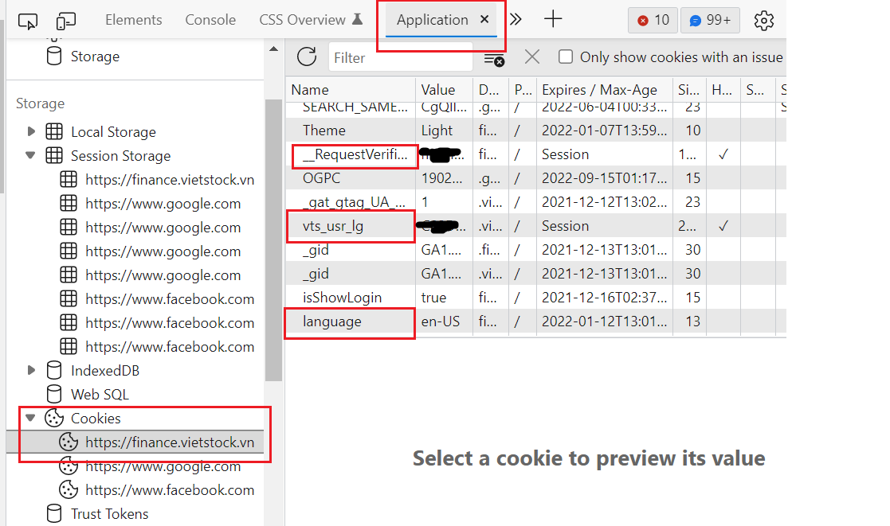

# Welcome to Vietnam Stock Data Package

This package bringing an easy way to access to Vietnam Stock data.

## Installation

Easy install via pip 

`pip install git+https://github.com/vuthanhdatt/vnstock-data-python.git`

User can also install a specific version

` pip install git+https://github.com/vuthanhdatt/vnstock-data-python.git@version_name`

Example:

`pip install git+https://github.com/vuthanhdatt/vnstock-data-python.git@v.0.1`


## Usage

In order to use this package, user need obtain Vietstock cookies. Here's instruction how to obtain it.

1. Go to [Vietstock finance]('https://finance.vietstock.vn/)
2. Log in to website, if you don't have account, register one.
3. Press `F12`, go to tab Application
4. Choose *Cookies* with `https://finance.vietstock.vn/` url



There are 3 value we need to take, `vts_usr_lg`, `__RequestVerificationToken`, `language`. Store these value in a dict, for example:

    COOKIES={"vts_usr_lg":"ABCDEF","language": "en-US","__RequestVerificationToken":"GhijKL"}
Now, you can using this cookies to access data with this package.

## Example

After installation, user can import package into `.py` file. For example, user can get price history of company with this code below:

```py
from vnstock_data.all_exchange import VnStock

COOKIES={"vts_usr_lg":"ABCDEF","language": "en-US","__RequestVerificationToken":"GhijKL"}

vndata = VnStock(COOKIES)

vndata.price('FTS', '02-05-2021','11-05-2021')
>>>                 High    Low   Open  Close   Volume  Adj Close  Average  High-Low
        Date
        2021-11-05  74000  69500  73500  71200   941700      71200    71833      4500
        2021-11-04  75000  70500  70500  73300   955800      73300    72710      4500
        2021-11-03  72000  68300  68300  70500  1334000      70500    70361      3700
        2021-11-02  68500  66600  67000  68000  1293500      68000    67503      1900
        2021-11-01  66300  62000  62700  66300  1389900      66300    64771      4300
        ...           ...    ...    ...    ...      ...        ...      ...       ...
        2021-02-18  17200  16650  16900  16800   533700      15000    16912       550
        2021-02-17  16800  16150  16400  16800   563900      15000    16444       650
        2021-02-09  16100  15500  15700  15900   382000      14200    15830       600
        2021-02-08  16500  15400  16400  15700   590500      14000    16088      1100
        2021-02-05  16500  16000  16150  16350   258000      14600    16248       500
```
Or user can get market index:

```py
from vnstock_data.hose import Hose
hose = Hose(COOKIES)
hose.market_index('02-05-2021','11-05-2021')
>>>                     PreClose     Open    Close     High      Low Change(%)      Volume     MarketCap
            Date
            2021-11-05   1448.34  1450.71  1456.51  1459.49  1444.51      0.56   874070856  5.648438e+09
            2021-11-04   1444.30  1442.89  1448.34  1451.98  1435.84      0.28   929526879  5.616765e+09
            2021-11-03   1452.46  1460.44  1444.30  1463.63  1444.30     -0.56  1505103001  5.597664e+09
            2021-11-02   1438.97  1439.61  1452.46  1452.46  1438.83      0.94  1009457944  5.625759e+09
            2021-11-01   1444.27  1449.32  1438.97  1451.81  1435.57     -0.37  1132355594  5.573175e+09
            ...              ...      ...      ...      ...      ...       ...         ...           ...
            2021-02-18   1155.78  1157.10  1174.38  1174.38  1148.66      1.61   614819219  4.424568e+09
            2021-02-17   1114.93  1127.46  1155.78  1151.54  1127.46      3.66   507695043  4.355273e+09
            2021-02-09   1083.18  1090.88  1114.93  1114.93  1078.98      2.93   519814193  4.201332e+09
            2021-02-08   1126.91  1127.06  1083.18  1127.06  1075.10     -3.88   696599614  4.078789e+09
            2021-02-05   1112.19  1114.79  1126.91  1126.91  1112.19      1.32   529870404  4.243698e+09
```


